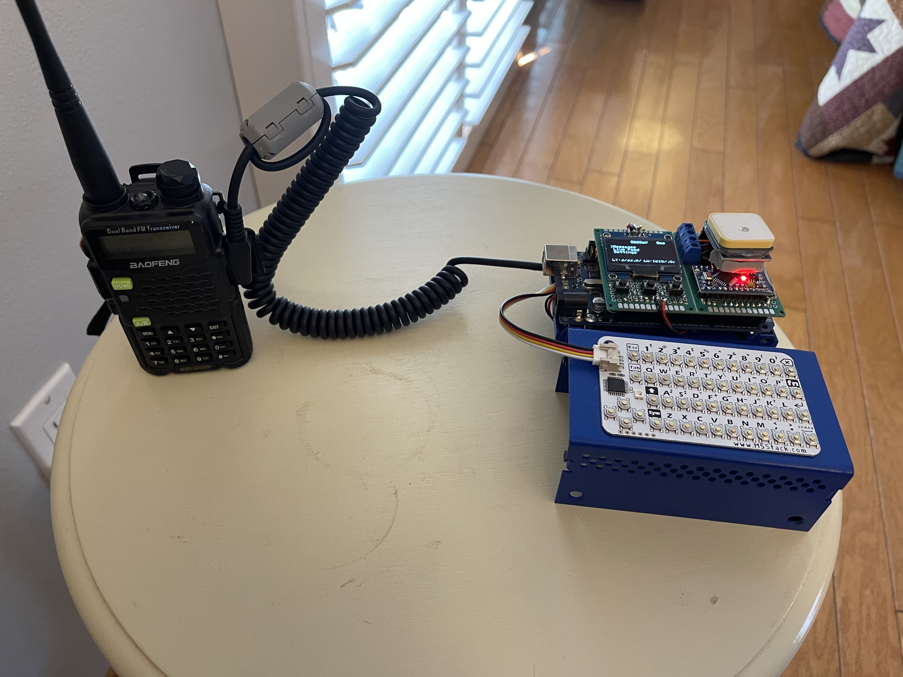

# HamMessenger # 
Click [here](https://github.com/dalethomas81/HamMessenger#updates) for updates.

HamMessenger is a portable, battery powered device that runs on a microcontroller and interfaces with an inexpensive ham radio to send and receive text messages and provide position updates using the [APRS](http://www.aprs.org/doc/APRS101.PDF) protocol. Messages and position updates sent via HamMessenger can be viewed on sites such as [aprs.fi](https://aprs.fi). HamMessenger messages are NOT encrypted!  

HamMessenger is intended to be used by licensed ham radio operators. For more information you can check out the [ARRL](http://www.arrl.org/what-is-ham-radio) website.  

The goal of the HamMessenger project is to create a device that uses ham radio as a medium for sending and receiving text messages. HamMessenger exists also to promote amateur radio, electronics, and programming. The project is currently in a beta prototyping stage but does function quite well. 

At the core of the the project is the [MicroAPRS](https://github.com/markqvist/MicroAPRS) modem created by [markqvist](https://github.com/markqvist). The primary controller is an Arduino Mega 2560 with the MicroAPRS Modem running on an Arduino Pro Mini. HamMessenger includes GPS functionality supplied by a Neo-6M GPS radio. For peripherals, an M5Stack CardKB keyboard is used for input and an SSD1106 Oled display for output.  

I will add some videos and pictures of the device in action asap. Please feel free to contribute to the project. I am very busy outside of this project so any help is greatly appreciated :)  

## Operation ##
Full instructions on how to operate HamMessenger will go here. For now, just a couple notes :)  

HamMessenger will beacon your location and comment according to the 'Beacon Frequency' settings in APRS Settings.  

To send a direct message to a station, select 'Messages' on the home screen and press the right arrow on the keyboard. A message will be sent according to the settings in APRS Settings.  

Screen navigation information can be found [here](https://github.com/dalethomas81/HamMessenger/blob/master/Documentation/Operating%20Instructions/Screen%20Navigation.md).  

Radio setup instructions can be found [here](https://github.com/dalethomas81/HamMessenger/blob/master/Documentation/Operating%20Instructions/Radio%20Setup.md).

Serial interface information can be found [here](https://github.com/dalethomas81/HamMessenger/blob/master/Documentation/Operating%20Instructions/Serial%20Interface.md).

## TODO ##
hardware:
- design enclosure

software:
- add "quick message" functionality. currently to send a message you highlight 'Messages' on the home screen and press the right key.  
- add ability to program the radio once connected for 'plug-n-play' experience (is this possible?)  
- add store and recall messages in SD card to save dynamic memory  
- add feature to be selective about message acknowledgments. currently any acknowlegment (from a second conversation) will reset the messaging sequencer.  

## Libraries ##
Here are links to the non-standard libraries that I am using for this project. All other libraries are standard and can be installed using the library manager built into the Arduino IDE.  
https://github.com/wonho-maker/Adafruit_SH1106  
https://github.com/mikalhart/TinyGPSPlus/releases/tag/v1.02b  
https://github.com/adafruit/Adafruit-GFX-Library/releases/tag/1.10.10  

## Compilation ##
The easiest way to compile HamMessenger is to use the Ardunio IDE. After all libraries are installed you can use the Verify button to compile or the Upload button to compile and write the binary to the main controller M1.  

The modem controller does not need to be compiled as the binary are already made available [here](https://github.com/markqvist/MicroAPRS/tree/master/precompiled).  

You can use AVRDude to write the binary to the modem controller. Instructions on how to do that will be coming soon. In the meantime, if you already know how to install and use AVRDude then feel free to make use of the batch file I created to do use AVRDude and an FTDI serial cable to write to the modem [here](/MicroAPRS%20Firmware%20Installer);  

## Parts ##
Find BOM information on parts [here](/Documentation/Parts/BOMs)  
Find Drawing information on parts [here](/Documentation/Parts/Drawings)  
Find Vendor information on parts [here](/Documentation/Parts/Vendors)  

Arduino:  
https://www.arduino.cc/en/pmwiki.php?n=Main/ArduinoBoardProMini  
https://store.arduino.cc/usa/mega-2560-r3  
https://gallery.autodesk.com/fusion360/projects/arduino-mega-2560-r3  

Keyboard:  
https://github.com/m5stack/M5-ProductExampleCodes/tree/master/Unit/CARDKB  
https://www.ebay.com/itm/124774337790?hash=item1d0d214cfe:g:kEkAAOSwEZlg0302  

OLED Display:   
https://www.ebay.com/itm/391731053045  
https://grabcad.com/library/0-96-oled-display-4-pin-1  
https://grabcad.com/library/ecran-oled-1-3-1

Modem:  
https://github.com/markqvist/MicroAPRS  
https://github.com/markqvist/MicroAPRS/blob/master/precompiled/microaprs-5v-ss-latest.hex  
https://github.com/markqvist/MicroAPRS/blob/master/documentation/Hardware%20Schematic.pdf  
https://unsigned.io/shop  
https://unsigned.io/product/micromodem-r23b  

GPS:   
https://www.ebay.com/sch/i.html?_id=221791352715&_nkw=Ublox+NEO-6M+GPS+Module+Aircraft+Flight+Controller+For+Arduino+MWC+IMU+APM2  
https://grabcad.com/library/gps-module-ublox_neo6mv2-1  
https://grabcad.com/library/ecran-oled-1-3-1

Case:  
https://www.duinocases.com/store/arduino-enclosures/duinocase-mega-arduino-mega-2560  

Radio Cable:  
https://www.amazon.com/dp/B08HT277B4?psc=1&smid=AZRLOQSTLHOAO&ref_=chk_typ_imgToDp  

Grove Connector:  
https://grabcad.com/library/grove-connectors-stand-and-flat-male-plugs-1/details?folder_id=2820551  

Battery Assembly:  
https://www.amazon.com/gp/product/B07SZKNST4/ref=ox_sc_act_title_1?smid=A3F3CVCOVVNP2J&psc=1  

Battery:  
Panasonic 18650 - don't have a link but you can get them on eBay or Amazon  

## Updates ##
04-JUL-2021: Version 1 of the pcb for HamMessenger has be sent for fabrication. The estimated delivery date is the 22nd of July. In the meantime I will be ordering the components to populate the board. As I do that I will make sure to get the links for the components and add them to the BOM in the Eagle folder.  
