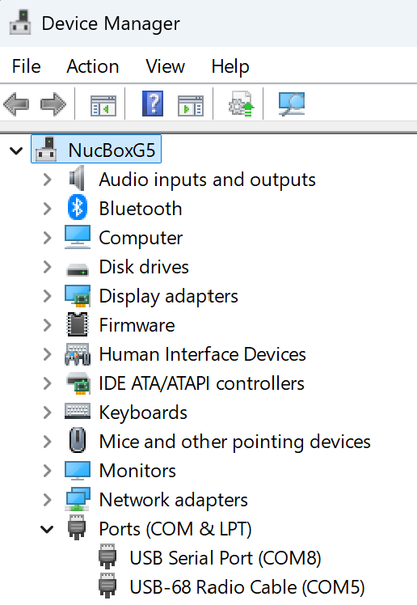
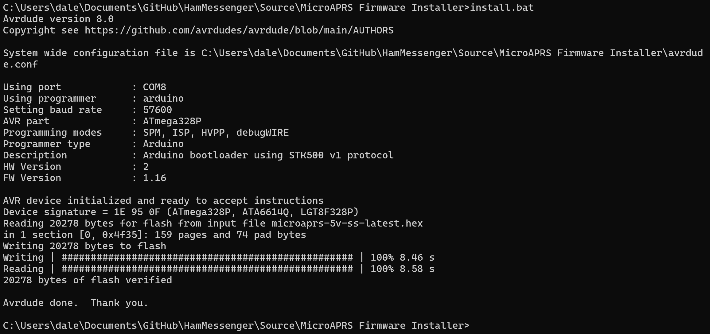
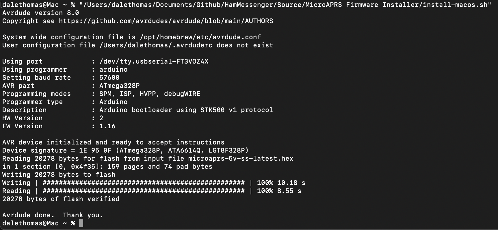

# MicroAPRS Firmware Flash Instructions
The batch and script files in this folder use AVRDUDE to flash the binarys of MicroAPRS to the Arduino Pro Mini. 
Originally I had the MicroAPRS binarys in this folder as well as a copy of AVRDUDE. 
However that is bad practice (and prob against their licenses) so I have removed them. I am leaving this batch file
here so that it can be used if needed. The [MicroAPRS](https://github.com/markqvist/MicroAPRS) repo has good information on how to flash it anyway.

## Windows
- Modify the install-windows.bat batch file to suit your configuration.  
- Using device manager set PORT manually by checking what your FTDI cable shows up as:    
  
- Download the latest version of avrdude from [here](https://github.com/avrdudes/avrdude/releases) and extract it to the same folder as the install-windows.bat file.  
- Run the batch file by double-clicking on it:  
  

## MacOS
- Modify the install-macos.sh script to suit your configuration.  
- Using the blowe command in terminal set PORT manually by checking what your FTDI cable shows up as:  
`ls /dev/tty.*`
- Make the script executable:  
`chmod +x install-macos.sh`
- install avrdude using brew:  
`brew install avrdude`
- if brew is not installed, you can install it from terminal like this:  
`/bin/bash -c "$(curl -fsSL https://raw.githubusercontent.com/Homebrew/install/HEAD/install.sh)"`
- download the MicroAPRS precompiled binary file from [here](https://github.com/markqvist/MicroAPRS/tree/master/precompiled) and place it in the same folder as the install-macos.sh script.  
    - `microaprs-5v-ss-latest.hex` for the 5v Pro-Mini
    - `microaprs-3v-ss-latest.hex` for the 3.3v Pro-Mini
- Run the script from terminal:  
  

*Hint: If avrdude complains about not being able to sync, you may need to manually hit the reset button on your Arduino Pro-Mini.*
